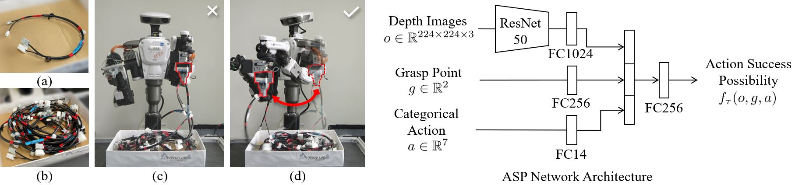

# Learning Efficient Policies for Picking Entangled Wire Harnesses: An Approach to Industrial Bin Picking 

[Xinyi Zhang](http://xinyiz0931.github.io), Yukiyasu Domae, [Weiwei Wan](https://wanweiwei07.github.io/) and [Kensuke Harada](https://www.roboticmanipulation.org/members2/kensuke-harada/)      
Osaka University

[arXiv](https://arxiv.org/abs/2112.05941) / [Video](https://www.youtube.com/watch?v=YoOiTp9HEY8&t=57s)  

## Overview  

 

Wire harnesses are essential connecting components in manufacturing industry but are challenging to be automated in industrial tasks such as bin picking. They are long, flexible and tend to get entangled when randomly placed in a bin. This makes the robot struggle to pick a single one from the clutter. Besides, modeling wire harnesses is difficult due to the complex structures of combining deformable cables with rigid components, making it unsuitable for training or collecting data in simulation. In this work, instead of directly lifting wire harnesses, we proposed to grasp and extract the target following circle-like trajectories until it is separated from the clutter. We learn a policy from real-world data to infer the optimal action and grasp from visual observation. Our policy enables the robot to perform non-tangle pickings efficiently by maximizing success rates and reducing the execution time. To evaluate our policy, we present a set of real-world experiments on picking wire harnesses. Results show a significant improvement in success rates from 49.2% to 84.6% over the tangle-agnostic bin picking method. We also evaluate the effectiveness of our policy under different clutter scenarios using unseen types of wire harnesses. The proposed method is expected to provide a practical solution for automating manufacturing processes with wire harnesses.

This repository contains the codes of training Action Success Prediction (ASP) module. 


## 1. Prerequisites

We're using a bin picking toolbox `bpbot: bin-picking-robot` containing some necessary functions such as grasp point detection. Please download and install this package. We've tested our code using Python 3.6, 3.7, 3.8. 

```
git clone https://github.com/xinyiz0931/bin-picking-robot.git bpbot
cd bpbot
pip insatll -r requirements.txt
pip install -e .
```

Then, install tensorflow for this repository. 

```
git clone https://github.com/xinyiz0931/aspnet.git
pip install tensorflow-gpu==2.2.0 tensorflow-probability==0.13.0
```

## 2. Data Preparation

Download the real-world dataset and trained models using following links. 

- [Dataset](https://drive.google.com/uc?id=1kOqyzhw-g0olamg8Ssz4n_zGrrX0BIrE&export=download)
    - 710 images named with `{date}_{grasp point u}_{grasp point v}_{action}_{clutter}_{success or failure}.png`, e.g., `20210623174655_382_366_4_1_0.png`. 

- [Final Model](https://drive.google.com/uc?id=1BGF-yek-Vopzy073m3r2I05sbho1dwH-&export=download)
    - `FinalModel.h5`: Model used in our policy. 

- [All Models](https://drive.google.com/uc?id=1A3RD6GHe2ET9tfw4ugncr2uID7g5rGpG&export=download)
    - `InitialModel.h5`
    - `2ndModel.h5`
    - `3rdModel.h5`
    - `FinalModel.h5`

## 3. Training

Use the following commands iteratively to train ASP model with active learning. 

```
python trainer.py
python active_learner.py
```

Remeber to replace the names of the latest modesl for active learning in both scripts. 

## 4. Usage

To speed up the action inference process, we use a server to pre-load the trained model and a client to directly infer the actions. 

```
python prediction/asp_server.py
python prediction/asp_client.py
```

Additionaly, you can also use our module of Model-free Grasp Detection in by the function `detect_grasp()` in `bpbot/binpicking.py`. This is also included in the `predict_client.py` file. A module implemented in the `bpbot/module_asp` can also be used the same as this repository.   
